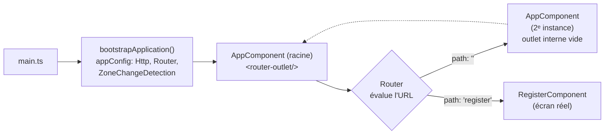
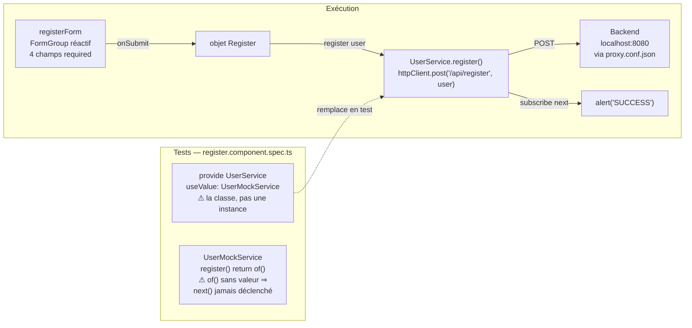

# Cartographie du projet Etudiant Frontend

*Angular 19.2 · standalone components · Jest*

Une application Angular réduite à l'essentiel : un unique écran d'inscription. Ce document explique comment le code est assemblé, trace le chemin d'une soumission de formulaire, et fait l'état des lieux réel des tests — mesuré en exécutant la suite Jest de ce dépôt.

`4 specs · 3 suites` · `85.1% instructions` · `0% branches` · `Angular Material`

**[↗ Version interactive (claude.ai)](https://claude.ai/code/artifact/2363a70b-e014-4dc7-902c-d1b51c17ff23)**

## Sommaire

1. [Vue d'ensemble](#01--vue-densemble)
2. [Arborescence](#02--structure)
3. [Démarrage & routage](#03--démarrage--routage)
4. [Formulaire d'inscription](#04--cœur-applicatif)
5. [État des tests](#05--état-des-tests)
6. [Pistes d'amélioration](#06--pistes-damélioration)

---

## 01 — Vue d'ensemble

### Une seule fonctionnalité, bout en bout

Le projet contient exactement un flux métier : créer un compte étudiant.

L'application est bootstrapée sans `NgModule` racine — c'est un projet Angular 19 **standalone** : chaque composant déclare directement ses propres imports (`RouterOutlet`, `ReactiveFormsModule`, les modules Angular Material…). Elle expose une seule route fonctionnelle, `/register`, qui affiche un formulaire réactif (`ReactiveFormsModule`) habillé avec Angular Material. La soumission est censée appeler une API REST (`POST /api/register`) exposée par un backend local sur le port `8080`, via le proxy défini dans `proxy.conf.json` — cohérent avec le parcours OCR « Testez et améliorez une application », où le front est livré volontairement sous-testé pour servir de terrain d'exercice.

Les tests tournent sous **Jest** (et non Karma/Jasmine, remplacés via `jest-preset-angular`), avec la couverture activée par défaut dans `jest.config.js`.

## 02 — Structure

### Arborescence de `src/`

15 fichiers, trois dossiers fonctionnels : `core` (modèle + services), `pages` (l'écran), `shared` (Material).

```text
src/
├── app/
│   ├── app.component.css
│   ├── app.component.html      — <router-outlet/> uniquement
│   ├── app.component.spec.ts
│   ├── app.component.ts
│   ├── app.config.ts           — providers racine (Http, Router…)
│   ├── app.routes.ts           — 2 routes : '' et 'register'
│   ├── core/
│   │   ├── models/
│   │   │   └── Register.ts     — interface du payload
│   │   └── service/
│   │       ├── user-mock.service.ts   — doublure de test
│   │       ├── user.service.spec.ts
│   │       └── user.service.ts        — appel HTTP réel
│   ├── pages/
│   │   └── register/
│   │       ├── register.component.css
│   │       ├── register.component.html
│   │       ├── register.component.spec.ts
│   │       └── register.component.ts  — formulaire + soumission
│   └── shared/
│       └── material.module.ts  — ré-export Angular Material
├── index.html
├── main.ts                     — bootstrapApplication()
└── styles.css
```

### Convention : `inject()` plutôt que l'injection par constructeur

Tout le code (composants, guards) utilise systématiquement la fonction `inject()` (Angular 14+) au lieu de l'injection par constructeur — par exemple `private userService = inject(UserService);` en tête de classe plutôt que `constructor(private userService: UserService) {}`. Ce choix est autant une nécessité qu'une convention : les guards fonctionnels (`CanActivateFn`, voir `auth.guard.ts`) sont de simples fonctions sans constructeur, donc `inject()` y est la seule option possible. Utiliser le même mécanisme dans les composants évite de mélanger deux styles de DI selon qu'un fichier est une classe ou une fonction.

## 03 — Démarrage & routage

### De `main.ts` à l'écran affiché

Pas de `AppModule` : `bootstrapApplication` démarre directement `AppComponent` avec la configuration de `app.config.ts`.



**Fig. 1** — `app.routes.ts` ne déclare que deux chemins. `/register` affiche l'écran utile ; le chemin racine `''` réinstancie `AppComponent` lui-même dans son propre `router-outlet`, dont l'outlet interne ne correspond ensuite à aucune route. Résultat : visiter `/` affiche une page vide, sans lien vers `/register`.

> ⚠️ **Point d'attention** — aucune page d'accueil ni redirection n'existe. Un utilisateur qui arrive sur `/` ne voit rien et n'a aucun moyen de trouver le formulaire sans connaître l'URL `/register`.

## 04 — Cœur applicatif

### Le formulaire d'inscription, de la saisie à l'API

`RegisterComponent` construit un `FormGroup` réactif, puis délègue l'appel réseau à `UserService`.



**Fig. 2** — Le chemin d'exécution réel (haut) part de la saisie et va jusqu'au backend. Le chemin de test (bas) est câblé pour substituer `UserMockService`, mais deux défauts se cumulent : le provider fournit la *classe* au lieu d'une instance, et `of()` sans argument ne propagera jamais de valeur — le formulaire n'est donc jamais testé jusqu'au succès.

```ts
// register.component.ts — onSubmit()
onSubmit(): void {
  this.submitted = true;
  if (this.registerForm.invalid) { return; }
  const registerUser: Register = { /* … 4 champs */ };
  this.userService.register(registerUser)
    .pipe(takeUntilDestroyed(this.destroyRef))
    .subscribe(() => {
      alert('SUCCESS!! :-)');
      // TODO : router l'utilisateur vers la page de login
    });
}
```

| Fichier | Rôle |
|---|---|
| `Register.ts` | Interface partagée : `firstName`, `lastName`, `login`, `password` — le contrat entre le formulaire et l'API. |
| `user.service.ts` | Service réel, injecté via `providedIn: 'root'`. Appelle vraiment le backend avec `HttpClient`. |
| `user-mock.service.ts` | Doublure pensée pour les tests, mais jamais correctement branchée (voir Fig. 2). |
| `material.module.ts` | Regroupe ~25 modules Angular Material/CDK derrière un seul `MaterialModule` réutilisable. |

> ⚠️ **Bug visible** — dans `register.component.html`, le champ mot de passe utilise `type="text"` au lieu de `type="password"` : la valeur saisie s'affiche en clair à l'écran.

## 05 — État des tests

### Ce que la suite Jest couvre vraiment

Résultats mesurés en exécutant `npx jest --coverage` sur ce dépôt : 3 suites, 4 tests, tous verts.

| Instructions | Branches | Fonctions | Lignes |
|---|---|---|---|
| 85.1% | **0%** | 25% | 83.6% |

| Fichier | Instr. | Lignes | État |
|---|---:|---:|---|
| `app.component.ts` (2 tests : création + titre) | 100% | 100% | 🟢 Couvert |
| `user.service.ts` (`register()` jamais appelé en test) | 83.3% | 80.0% | 🟠 Fumée seulement |
| `user-mock.service.ts` (n'est jamais réellement invoqué par un test) | 66.7% | 66.7% | 🟠 Fumée seulement |
| `register.component.ts` (lignes 35–61 non couvertes : `ngOnInit`, `onSubmit`, `onReset`) | 62.5% | 59.1% | 🔴 Lacunaire |
| `material.module.ts` (module de ré-export, trivial) | 100% | 100% | 🟢 Couvert |

> ⚠️ **85% d'instructions mais 0% de branches** — chaque test se contente d'instancier un composant ou un service (`expect(x).toBeTruthy()`). Aucun test ne remplit le formulaire, ne le soumet, ne vérifie un message de validation ni le contenu envoyé à l'API : le pourcentage global masque l'absence totale de test de comportement.

## 06 — Pistes d'amélioration

### Par où continuer

Dans l'esprit de l'exercice « Testez et améliorez une application » : d'abord combler les tests de comportement, puis corriger les défauts qu'ils révèlent.

1. **[Priorité 1] Corriger l'injection du mock** — Remplacer `useValue: UserMockService` par `useValue: new UserMockService()` (ou `useClass`), et faire retourner à `register()` une valeur réelle via `of({})`.
2. **[Priorité 1] Tester le comportement du formulaire** — Remplir `registerForm`, appeler `onSubmit()`, vérifier que `UserService.register` reçoit le bon payload et que `submitted` / les erreurs de validation s'affichent quand un champ requis est vide.
3. **[Priorité 2] Corriger le champ mot de passe** — Passer `type="text"` à `type="password"` dans `register.component.html`.
4. **[Priorité 2] Donner un sens à la route racine** — Rediriger `''` vers `/register` (`redirectTo`) plutôt que de réinstancier `AppComponent` dans son propre outlet.
5. **[Priorité 3] Remplacer `alert()` par une vraie redirection** — Le TODO existe déjà dans le code : router vers une page de connexion après un succès, avec un retour visuel (snackbar Material déjà disponible via `MatSnackBarModule`).

---

*Généré à partir de l'analyse du code source et d'une exécution réelle de `npx jest --coverage` sur le dépôt, le 9 septembre 2026.*
