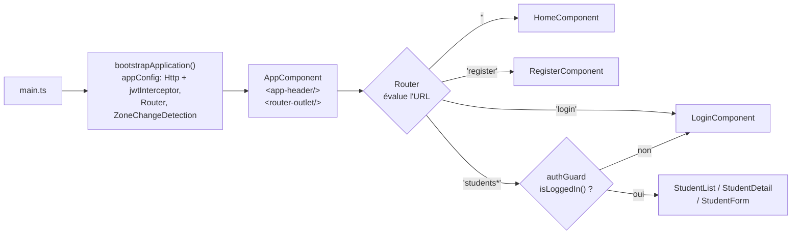
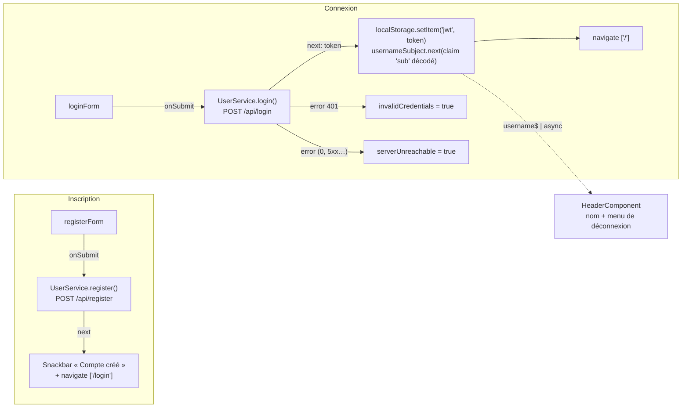
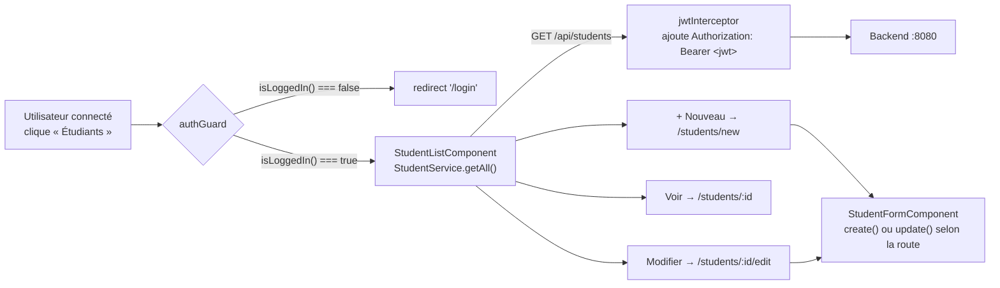

# Cartographie du projet Etudiant Frontend

*Angular 19.2 · standalone components · Jest*

Application Angular affichée sous le nom **EtuBibliothèque** : inscription, connexion (JWT), page d'accueil personnalisée, et une gestion CRUD des étudiants protégée par authentification. Ce document explique comment le code est assemblé, trace les principaux flux, et fait l'état des lieux réel des tests — mesuré en exécutant la suite Jest de ce dépôt.

`7 specs · 4 suites` · `79.3% instructions` · `37.5% branches` · `Angular Material`

**[↗ Version interactive (claude.ai)](https://claude.ai/code/artifact/2363a70b-e014-4dc7-902c-d1b51c17ff23)** — *généré lors d'une itération antérieure de ce document, peut ne plus refléter l'état ci-dessous.*

## Sommaire

1. [Vue d'ensemble](#01--vue-densemble)
2. [Arborescence](#02--structure)
3. [Démarrage & routage](#03--démarrage--routage)
4. [Cœur applicatif](#04--cœur-applicatif)
5. [État des tests](#05--état-des-tests)
6. [Pistes d'amélioration](#06--pistes-damélioration)

---

## 01 — Vue d'ensemble

### Trois flux : compte, session, étudiants

Le projet couvre désormais trois flux métier : créer un compte, se connecter, et gérer une liste d'étudiants (CRUD) réservée aux utilisateurs connectés.

L'application est bootstrapée sans `NgModule` racine — c'est un projet Angular 19 **standalone** : chaque composant déclare directement ses propres imports (`RouterOutlet`, `ReactiveFormsModule`, les modules Angular Material…), et l'injection de dépendances se fait partout via la fonction `inject()` plutôt que par constructeur (voir [02 — Structure](#convention--inject-plutôt-que-linjection-par-constructeur)) — y compris dans les guards fonctionnels, qui n'ont pas de constructeur.

L'API REST (`/api/register`, `/api/login`, `/api/students/**`) est exposée par un backend local sur le port `8080`, via le proxy défini dans `proxy.conf.json`. Un intercepteur HTTP global (`jwtInterceptor`) attache le token JWT stocké en `localStorage` à chaque requête sortante. Un guard fonctionnel (`authGuard`) protège les routes `/students*` et redirige vers `/login` si l'utilisateur n'est pas connecté.

Les tests tournent sous **Jest** (et non Karma/Jasmine, remplacés via `jest-preset-angular`), avec la couverture activée par défaut dans `jest.config.js`.

## 02 — Structure

### Arborescence de `src/`

38 fichiers, quatre dossiers fonctionnels dans `core` (`guards`, `interceptors`, `models`, `service`), cinq écrans dans `pages`, un composant partagé (`header`) en plus de `material.module.ts`.

```text
src/
├── app/
│   ├── app.component.css
│   ├── app.component.html      — <app-header/> puis <router-outlet/>
│   ├── app.component.spec.ts
│   ├── app.component.ts
│   ├── app.config.ts           — providers racine : Http (+ jwtInterceptor), Router…
│   ├── app.routes.ts           — 7 routes : '', register, login, students*
│   ├── core/
│   │   ├── guards/
│   │   │   └── auth.guard.ts          — authGuard : isLoggedIn() sinon redirect /login
│   │   ├── interceptors/
│   │   │   └── jwt.interceptor.ts     — ajoute "Authorization: Bearer <jwt>"
│   │   ├── models/
│   │   │   ├── Login.ts               — { login, password }
│   │   │   ├── LoginResponse.ts       — { token }
│   │   │   ├── Register.ts            — payload d'inscription
│   │   │   ├── StudentRequest.ts      — payload CRUD (sans id)
│   │   │   └── StudentResponse.ts     — payload CRUD (avec id)
│   │   ├── service/
│   │   │   ├── student-mock.service.ts — doublure de test (jamais branchée)
│   │   │   ├── student.service.ts      — CRUD /api/students
│   │   │   ├── user-mock.service.ts    — doublure de test
│   │   │   ├── user.service.spec.ts
│   │   │   └── user.service.ts         — register/login/logout, username$, isLoggedIn()
│   │   └── utils/
│   │       └── jwt.util.ts             — decodeJwt() : décode le payload base64url
│   ├── pages/
│   │   ├── home/                       — page d'accueil, salue l'utilisateur via username$
│   │   ├── login/                      — formulaire + gestion des erreurs (401 / injoignable)
│   │   ├── register/                   — formulaire + snackbar + redirection
│   │   ├── student-detail/             — fiche lecture seule d'un étudiant
│   │   ├── student-form/               — création + édition (même composant)
│   │   └── student-list/               — liste + suppression
│   └── shared/
│       ├── header/                     — titre (lien accueil) + menu utilisateur
│       └── material.module.ts          — ré-export Angular Material
├── index.html
├── main.ts                     — bootstrapApplication()
└── styles.css
```

### Convention : `inject()` plutôt que l'injection par constructeur

Tout le code (composants, guards) utilise systématiquement la fonction `inject()` (Angular 14+) au lieu de l'injection par constructeur — par exemple `private userService = inject(UserService);` en tête de classe plutôt que `constructor(private userService: UserService) {}`. Ce choix est autant une nécessité qu'une convention : les guards fonctionnels (`CanActivateFn`, voir `auth.guard.ts`) sont de simples fonctions sans constructeur, donc `inject()` y est la seule option possible. Utiliser le même mécanisme dans les composants évite de mélanger deux styles de DI selon qu'un fichier est une classe ou une fonction.

## 03 — Démarrage & routage

### De `main.ts` à l'écran affiché

Pas de `AppModule` : `bootstrapApplication` démarre directement `AppComponent`, qui affiche le header sur toutes les routes puis délègue au routeur.



**Fig. 1** — Le header est monté une seule fois par `AppComponent` et reste affiché quelle que soit la route ; il s'abonne à `UserService.username$` pour savoir quoi afficher. Les quatre routes `students*` (`students`, `students/new`, `students/:id/edit`, `students/:id`) partagent le même `authGuard`, qui redirige vers `/login` si `isLoggedIn()` renvoie `false`.

> ℹ️ **Ordre des routes** — `students/new` est déclarée avant `students/:id` dans `app.routes.ts` : sans cet ordre, Angular matcherait `new` comme une valeur du paramètre `:id`.

## 04 — Cœur applicatif

### Authentification : inscription → connexion → session

`RegisterComponent` et `LoginComponent` délèguent tous deux à `UserService`, qui garde l'état de connexion à jour via un `BehaviorSubject` (`username$`) plutôt qu'une simple lecture ponctuelle de `localStorage` — c'est ce qui permet au header de réagir en direct au login/logout sans être réinstancié (il vit en dehors du `router-outlet`).



**Fig. 2** — Le backend signe le JWT avec le nom d'utilisateur dans le claim standard `sub` (`Jwts.builder().subject(...)` côté Spring) ; `UserService` le décode via `decodeJwt()` pour peupler `username$`. Côté erreurs, seul un `401` distingue un mauvais mot de passe d'un backend réellement injoignable — un point qui a piégé une première implémentation basée sur `error.status === 0`, un statut que le proxy de dev (Vite) ne renvoie jamais : il transforme un `ECONNREFUSED` en `500` avant qu'il n'atteigne le navigateur.

### Gestion des étudiants : CRUD protégé par guard + intercepteur



**Fig. 3** — `StudentFormComponent` sert à la fois la création et l'édition : `ngOnInit` regarde si l'URL porte un `:id` (`ActivatedRoute.snapshot.paramMap`) pour décider d'appeler `create()` ou `update()`, et pré-remplir le formulaire via `getById()` le cas échéant. `jwtInterceptor` est enregistré globalement (`provideHttpClient(withInterceptors([jwtInterceptor]))`), donc il s'applique aussi — sans effet — aux appels publics `/api/login` et `/api/register`.

| Fichier | Rôle |
|---|---|
| `Register.ts` / `Login.ts` / `LoginResponse.ts` | Contrats des payloads d'authentification. |
| `StudentRequest.ts` / `StudentResponse.ts` | Contrats CRUD : `StudentRequest` n'a pas d'`id` (créé côté serveur), `StudentResponse` l'a. |
| `user.service.ts` | `register()`, `login()`, `logout()`, `isLoggedIn()`, et `username$` (état réactif dérivé du JWT). |
| `student.service.ts` | Cinq méthodes CRUD (`getAll`, `getById`, `create`, `update`, `delete`) vers `/api/students`. |
| `auth.guard.ts` | Guard fonctionnel `CanActivateFn`, synchrone via `isLoggedIn()`. |
| `jwt.interceptor.ts` | `HttpInterceptorFn` fonctionnel, ajoute l'en-tête `Authorization` si un JWT est stocké. |
| `user-mock.service.ts` / `student-mock.service.ts` | Doublures pensées pour les tests ; `user-mock` est branchée dans `login.component.spec.ts`, `student-mock` n'est utilisée par aucun test. |
| `material.module.ts` | Regroupe ~25 modules Angular Material/CDK derrière un seul `MaterialModule` réutilisable. |

## 05 — État des tests

### Ce que la suite Jest couvre vraiment

Résultats mesurés en exécutant `npx jest --coverage` sur ce dépôt : 4 suites, 7 tests, tous verts.

| Instructions | Branches | Fonctions | Lignes |
|---|---|---|---|
| 79.3% | **37.5%** | 36.4% | 77.7% |

| Fichier | Instr. | Lignes | État |
|---|---:|---:|---|
| `app.component.ts` | 100% | 100% | 🟢 Couvert |
| `header.component.ts` (`logout()`, lignes 22–23, jamais exercé) | 84.6% | 81.8% | 🟠 Partiel |
| `user.service.ts` (lignes 21, 41–47, 60 non couvertes : erreur de décodage, `logout()`, `isLoggedIn()`) | 80.0% | 79.2% | 🟠 Partiel |
| `user-mock.service.ts` (jamais réellement invoquée par un test) | 50% | 50% | 🟠 Fumée seulement |
| `login.component.ts` (lignes 38–65 non couvertes : tout `onSubmit()`) | 61.3% | 58.6% | 🔴 Lacunaire |
| `register.component.ts` (lignes 39–65 non couvertes : tout `onSubmit()`) | 65.5% | 63.0% | 🔴 Lacunaire |
| `material.module.ts` | 100% | 100% | 🟢 Couvert |
| `home.*`, `student-list/detail/form.*`, `student.service.ts`, `student-mock.service.ts`, `auth.guard.ts`, `jwt.interceptor.ts` | — | — | ⚫ **Aucun test** (0 fichier `.spec.ts`) |

> ⚠️ **79% d'instructions mais 37.5% de branches** — la plupart des specs se contentent d'instancier un composant (`fixture.detectChanges()`) sans jamais soumettre un formulaire ni déclencher une erreur HTTP : `onSubmit()` n'est exécuté nulle part pour `LoginComponent` et `RegisterComponent`.

> ⚠️ **Mock mal câblé dans `register.component.spec.ts`** — le provider fournit `useValue: UserMockService` (la *classe*), pas une instance (`new UserMockService()`) comme le fait correctement `login.component.spec.ts` depuis sa création. Tant que `RegisterComponent.onSubmit()` n'est pas exercé par un test, ça ne casse rien — mais le jour où un test appellera `userService.register(...)`, il échouera avec « `.register is not a function` ».

> ⚫ **La fonctionnalité « étudiants » n'a aucun test** — six fichiers (`student.service.ts`, `student-mock.service.ts`, `auth.guard.ts`, `jwt.interceptor.ts`, et les trois composants `student-*`) ont été ajoutés sans une seule spec ; Jest ne les instrumente même pas puisqu'aucun test ne les importe.

## 06 — Pistes d'amélioration

### Déjà résolu depuis la première version de ce document

- ✅ Champ mot de passe en `type="password"` (était `type="text"` dans `register.component.html`).
- ✅ La route racine `''` affiche une vraie page d'accueil (`HomeComponent`) au lieu de réinstancier `AppComponent` dans son propre `router-outlet`.
- ✅ `alert()` remplacé par un snackbar Material (`MatSnackBar`) suivi d'une vraie redirection, à l'inscription comme à la connexion.
- ✅ Mock `UserService` correctement instancié (`new UserMockService()`) dans `login.component.spec.ts`.

### Reste à faire

Dans l'esprit de l'exercice « Testez et améliorez une application » : d'abord combler les tests de comportement, puis corriger les défauts qu'ils révèlent.

1. **[Priorité 1] Corriger l'injection du mock dans `register.component.spec.ts`** — remplacer `useValue: UserMockService` par `useValue: new UserMockService()`, sur le modèle de `login.component.spec.ts`.
2. **[Priorité 1] Tester le comportement des formulaires login/register** — remplir le formulaire, appeler `onSubmit()`, vérifier le payload envoyé, les messages de validation, et les deux branches d'erreur du login (`invalidCredentials` vs `serverUnreachable`).
3. **[Priorité 1] Écrire des tests pour la fonctionnalité étudiants** — actuellement 0% de couverture sur `StudentService` (5 méthodes CRUD), `authGuard` (redirection si non connecté), `jwtInterceptor` (en-tête `Authorization` ajouté/absent), et les trois composants `student-*`.
4. **[Priorité 2] Réduire la taille du bundle initial** — `ng build` dépasse le budget de 214 kB (714 kB pour un budget de 500 kB) ; charger les routes `students*` en lazy (`loadComponent`) plutôt qu'en imports statiques dans `app.routes.ts` réduirait le bundle initial.
5. **[Priorité 3] Réagir à un JWT expiré** — aujourd'hui, un token expiré rencontré par `jwtInterceptor` n'est pas détecté côté front ; un `401` sur une route protégée pourrait déclencher un `logout()` automatique plutôt que de laisser l'utilisateur face à une erreur silencieuse.

---

*Généré à partir de l'analyse du code source et d'une exécution réelle de `npx jest --coverage` sur le dépôt, le 11 septembre 2026.*
